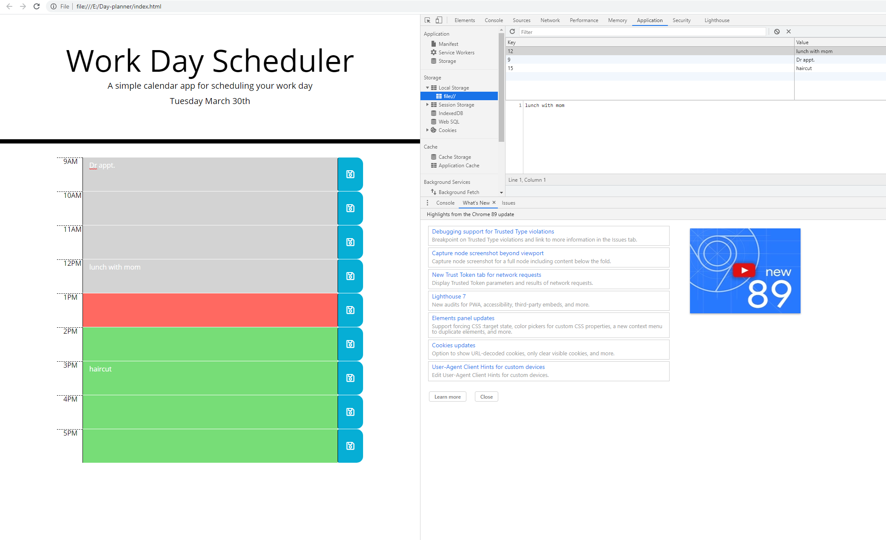

# Day-planner
day planner that allows you to save an event to local storage for later reference and shows the hour of the day, date and day of the week 

Built with HTML, CSS, and Javascript
#
[github](https://github.com/Nparson88/Day-planner)

[deplayed-app](https://nparson88.github.io/Day-planner/.)